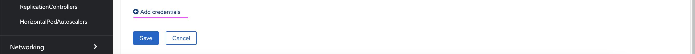
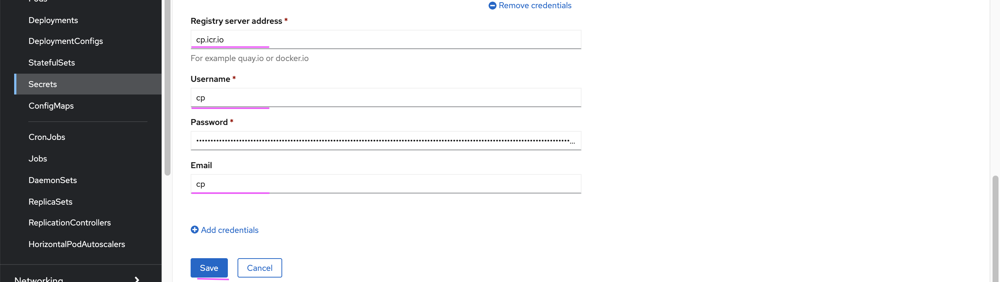

# Updating Global Pull Secrets before installing WAIOps 3.2

This documentation explains about how to update Global Pull Secret in Openshift before installing WAIOps 3.2

## Get the IBM entitlement key

1. Goto https://myibm.ibm.com/products-services/containerlibrary

2. Copy the key in notepad

## Edit Secret

3. Select the secret called `pull-secret` under the namespace `openshift-config`

4. Choose `Edit Secret`

5. Click on `Add credentials` menu

## Enter credentials

6. Enter the below values.

- cp.icr.io
- cp
- entitlement key copied in notepad
- cp

7. Click on `save` button.

Global pull secrets got updated with ibm entitlement key.

## Reload the worker nodes

Worker nodes to be be reloaded for the pull secrets to reflect.

8. Goto http://cloud.ibm.com

9. Choose your OCP cluster

10. Click on `Worker Nodes`

11. Choose 1 node at a time (checkbox)

12. Click on `Reload` menu and wait until it get reloaded and the status become `Normal`. Reload process may take 5 to 10 minutes per node.

13. Repeat the steps from 11 for each node.

#### Page Status : Final