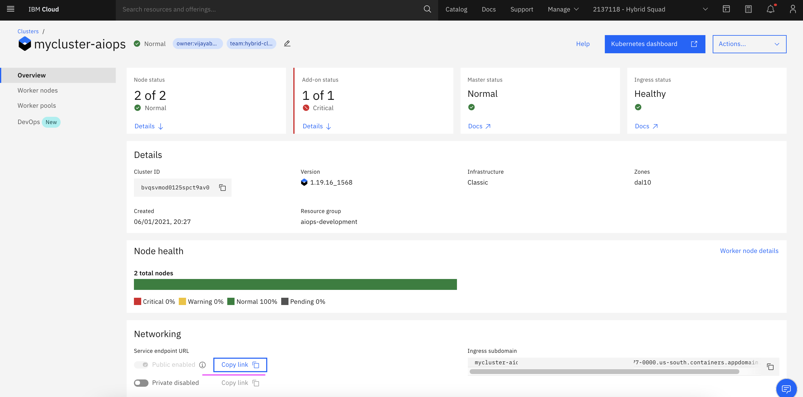
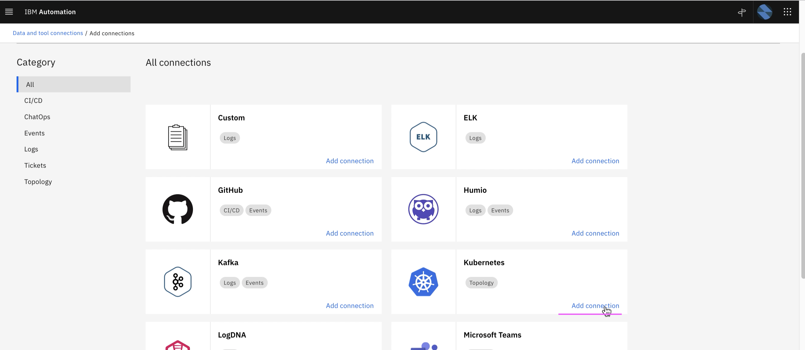
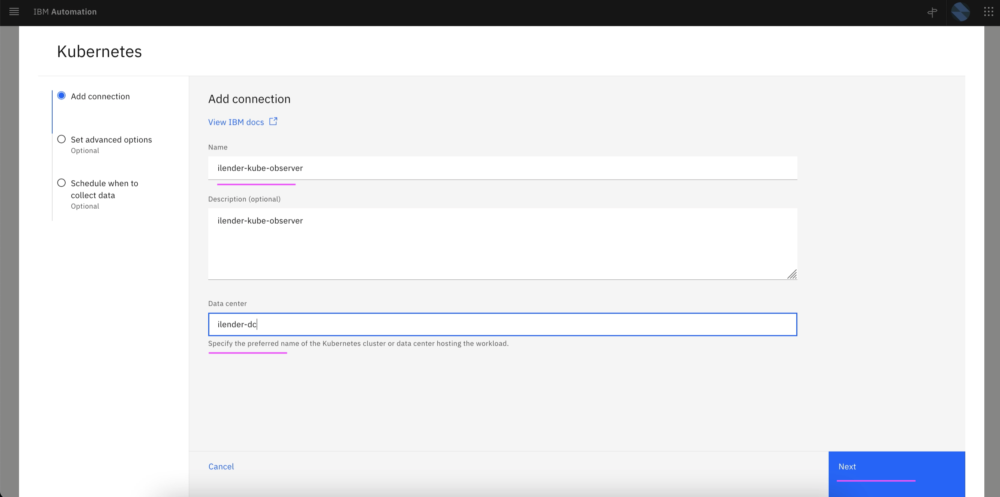
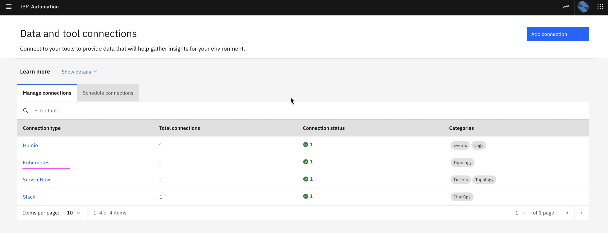

# Setup Kubernetes Integration or Observer

This document explains about how to setup Kubernetes Observer in Watson AIOps.

## 1. Get Kubernetes Cluster Access Details

As part of the kubernetes observer, it is required to communicate with the target cluster. So it is required to have the URL and Access token details of the target cluster. 

Do the following.


#### 1. Login

Login into Kubernetes cluster using cli.

#### 2. Access token 

There is a script file [files/00-create-kube-observer-token.sh](./files/00-create-kube-observer-token.sh) to generate access token in Kubernetes cluster

Run the script.

```
sh files/00-create-kube-observer-token.sh
```

This will print the access token, you can copy and keep it in notepad.

#### 3. URL and Port 

Need to get the URL and Port of the Kubernetes Cluster

In the IBM Cloud, cluster detail page, Click on the `Copy Link` link under the `Servive Point URL` to get the Kubernetes URL. 

It may give a url like this 

```
https://c111.us-south.containers.cloud.ibm.com:32429
```



## 2. Create Kube Observer Connection

1. Click on `Add Connection`


2. Click on `Add Connection`



3. Click on `Connect`


4. Enter any value in `Name`,  `Description` and `Data Center`



5. Enter the following

 - Connection Type : Load
 - IP Address : `URL` portion of the `Service Enpoint URL` retrieved in the above section
 - Port : `Port` portion of the `Service Enpoint URL` retrieved in the above section
 - Token : `Access Token` retrieved in the above section
 - Namespace : Any name where you have deployed your app to observe

6. Click on `Next`


7. Enter the following

 - Schedule Request : On
 - Interval : 5

8. Click on `Done`


9. Kubernetes connection is created successfully. This might have observer the resources found in the given namespace of the kubernetes cluster and create a Resource group




#### Page Status : Final