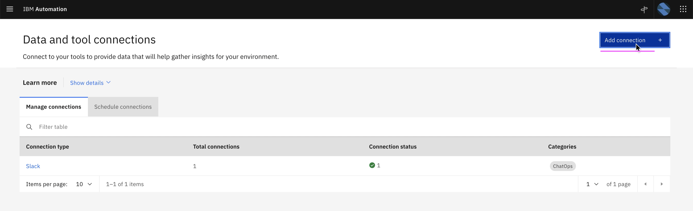
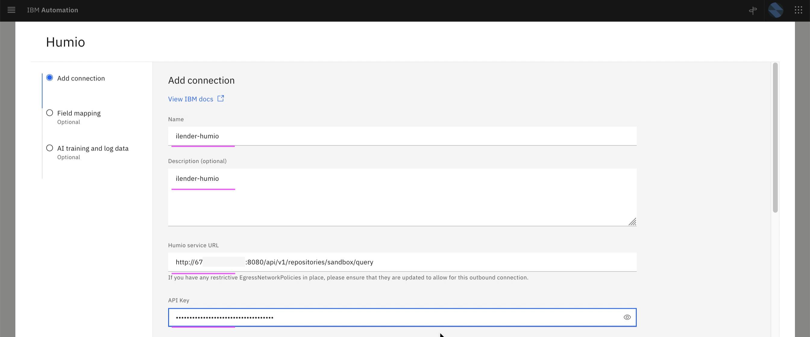
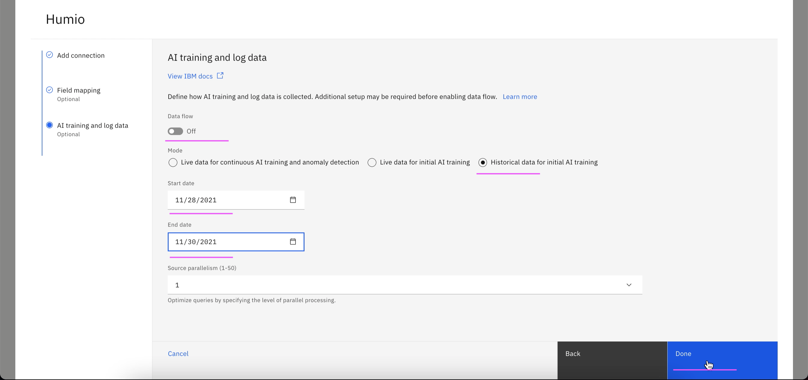
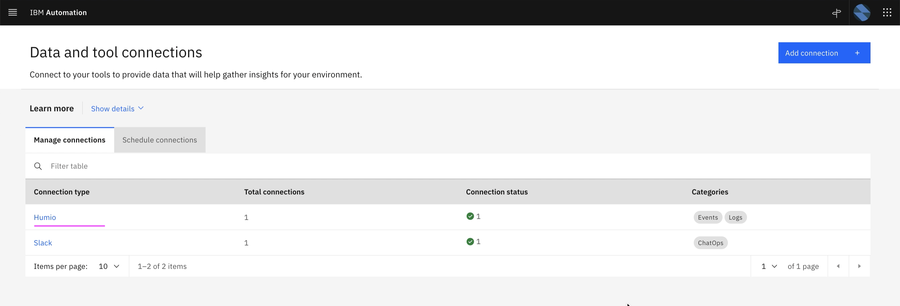

# Setup Humio Integration

This article explains about how to setup Humio Integration in Watson AIOps.

The article is based on the the following.

- RedHat OpenShift 4.8 on IBM Cloud (ROKS)
- Watson AI-Ops 3.2.0

1. Goto the page `Data and tool integrations`

2. Click on  `Add Integration`

3. In the `Humio` card click on the `Add Integration` link

4. Click on `Connect` 

5. Enter the below field values

- Name 
- Description 
- Humio sevice URL

    Sample value : http://1.1.1.1:8080/api/v1/repositories/sandbox/query

- API Key of the Humio (Should be Account key not the ingestion key)

6. Click on `Next` 

6. Click on `Test Connection` to check the connection with humio

7. Click on `Next`

8. Enter the below field values

- Dataflow : Off 
- Mode: Historical ..
- Start Date : yesterday date
- End Date  : tommorrow date

7. Click on `Done`

8. Humio connection created

