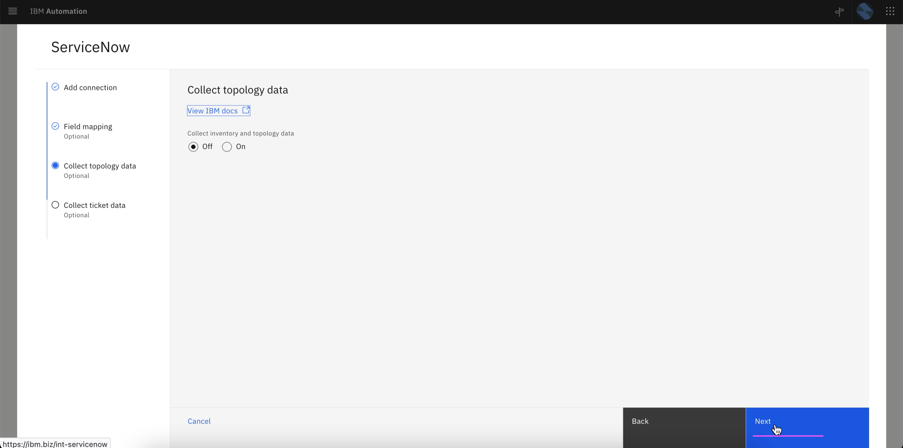
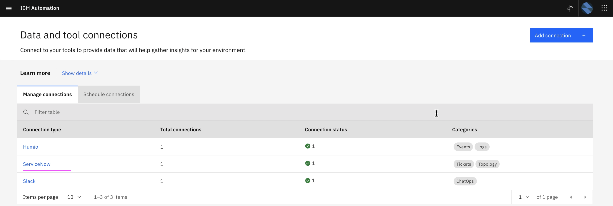

# Setup ServiceNow Integration

This article explains about how to setup ServiceNow Integration in Watson AIOps.

The article is based on the the following.

- RedHat OpenShift 4.8 on IBM Cloud (ROKS)
- Watson AI-Ops 3.2.0


1. Goto the page `Data and tool integrations`

2. Click on  `Add Integration`


3. In the `ServiceNow` card click on the `Add Integration` link


4. Click on `Connect` 


5. Enter the below field values

- Name 
- Description 
- ServiceNow URL
- User
- Password

6. Click on `Next` 


7. Click on `Test Connection` to check the connection with humio

8. Click on `Next`


9. Click on `Next`



10. Enter the below field values

- Dataflow : Off 
- Mode: Historical ..
- Start Date : Last year date
- End Date  : tommorrow date

11. Click on `Done`


12. ServiceNow connection created




1. Goto the page `Data and tool integrations`

2. In the `ServiceNow` card click on the `Add Integration` link


3. Enter the below field values

```
- Name 
- URL
    Sample value : https://dev-11111.service-now.com

- UserID
- Password

- Data flow - on
- Historical Data for initial AI Training
- Start date (2 years old)
- End date (current date)
```

4. Click on `Integrate`


5. Integration is created.

