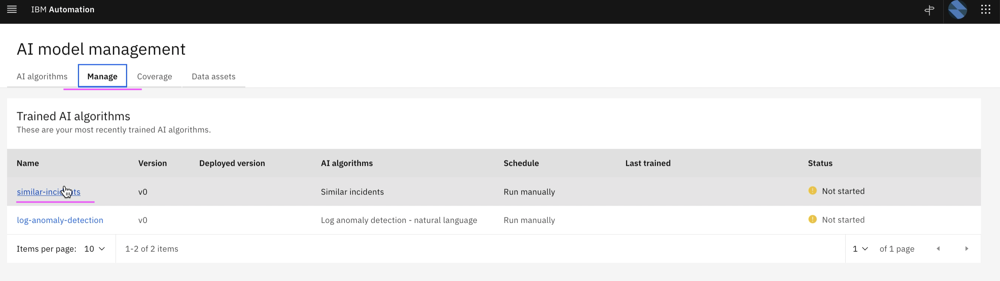

# Training - Similar Incidents

This article explains about how to do Training of Similar Incidents in Watson AIOps.

The article is based on the the following

- RedHat OpenShift 4.8 on IBM Cloud (ROKS)
- Watson AI-Ops 3.2.0

## 1. Pre Requisite

### Sample Incidents for Training

Atleast 5 incidents should have been created in service-now, resolved with proper resolve comments and closed.

Here are the sample incidents from service now.

You can refer to the document to create these incidents in sevice now. https://github.com/ibm-gsi-ecosystem/watson-ai-ops-snow/tree/main/01-snow-incidents

## 2. Enable Data flow for Training

1. Goto the page `Data and Model Management` and select `ServiceNow` 

2. Click on `Edit` menu from the selected `ServiceNow` integrations.

3. Enter the following values

- Data flow is on
- Historical data for Initial AI-Training
- Start Date should be past date 
- End Date could be current date 

4. Click on `Save` button.

## 3.Start Training

1. Goto the page `AI Model Management`

2. Click on `Manage` tab.

3. Click on `Similar Incidents` link.

4. Click on `Start Training` link.

5. Training starts

