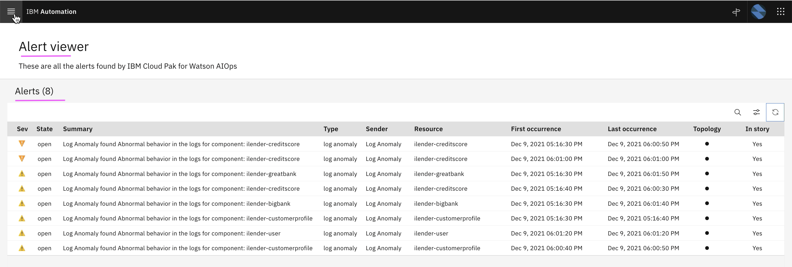
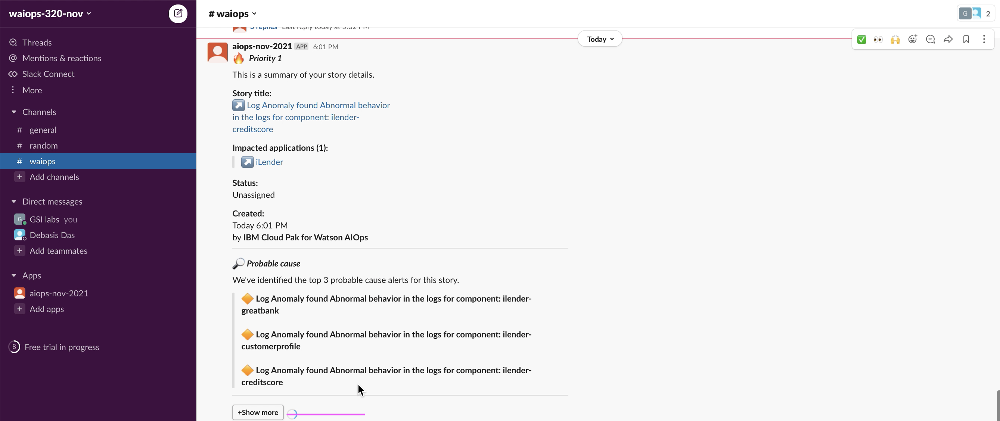
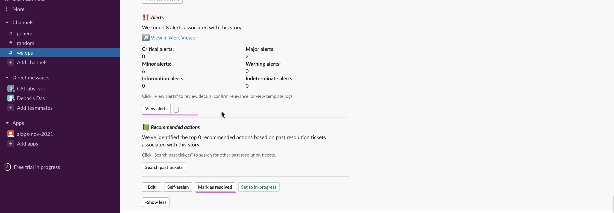
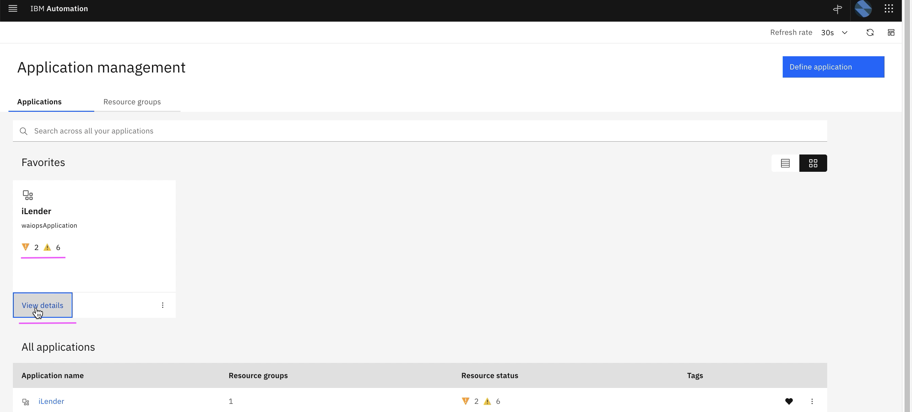
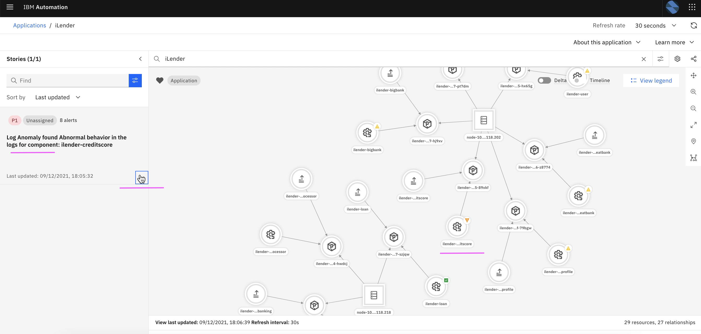
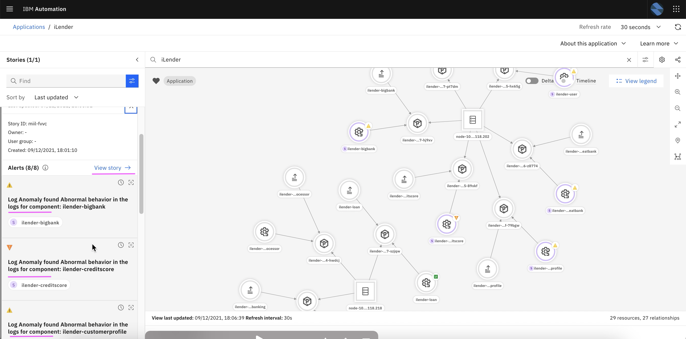
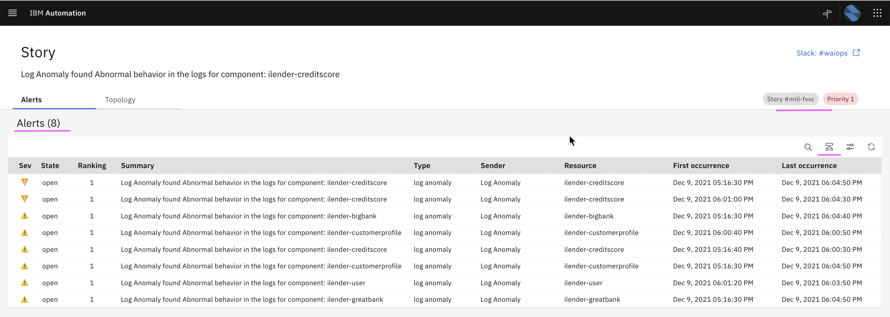
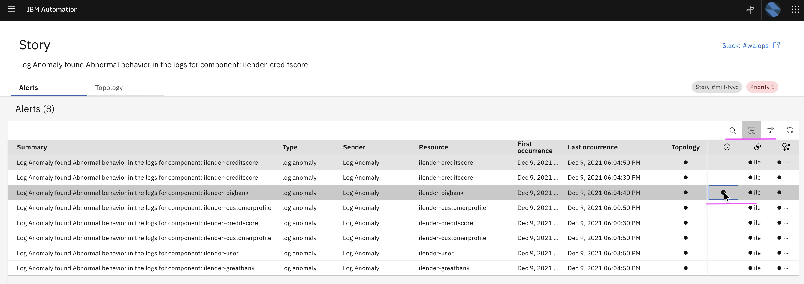

# Viewing Inferencing Results

This article explains about what and where to view Inferencing results.

The article is based on the the following

- RedHat OpenShift 4.8 on IBM Cloud (ROKS)
- Watson AI-Ops 3.2.0

## 1. Alert Viewer

1. Alert Viewer shows all the alerts created for this probelm.

## 2. Slack Story

Slack story shows the incident details to SRE.

1. Slack story for this probelm

2. Click on `Show More` to see the details.

3. Click on `View Alert Details` to see the alert details.

4. Click on `View Alerts` to see the alerts.

## 3. Application Management

In application management also the story is shown.

1. Application tiles showing the alerts

2. Click on `View Details` to see the details.

You can see the story and topology.

3. Click on `Hand icon` to see the alerts.

4. Click on `View Story` to see the story viewer.

## 4. Story Viewer

1. Story Viewer shows story and its events in web.

2. Click on `Topology Icon` to see Grouping.

3. Click on  `Seasonal Grouping Icon` to see Grouping.

3. Click on  `Topology` tab to see Topology.

## 5. Resolving Incident

1. Click on  `Mark As Resolved` button in Slack Story

2. Click on  `Submit` button in resolve the Slack Story

