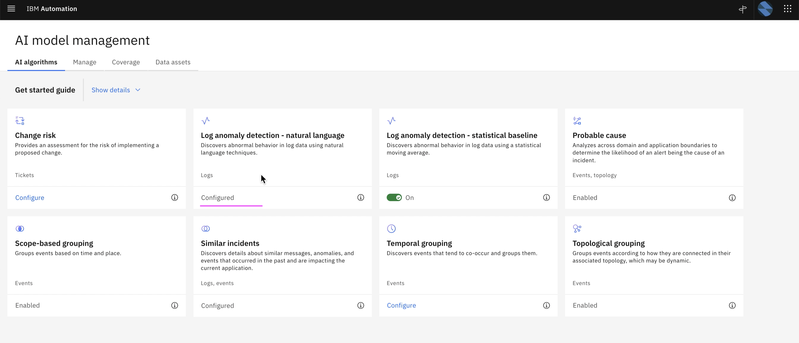
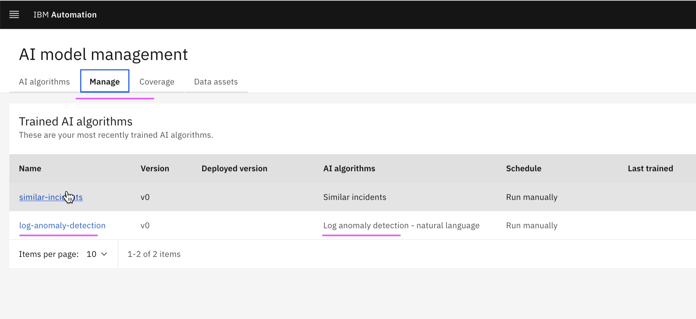

# Create AI-Model Definition for Log Anomaly

This article explains about how to Create Training Definition for Similar Incidents in Watson AIOps.

The article is based on the the following

- RedHat OpenShift 4.8 on IBM Cloud (ROKS)
- Watson AI-Ops 3.2.0

## Steps

#### Page Status : Final