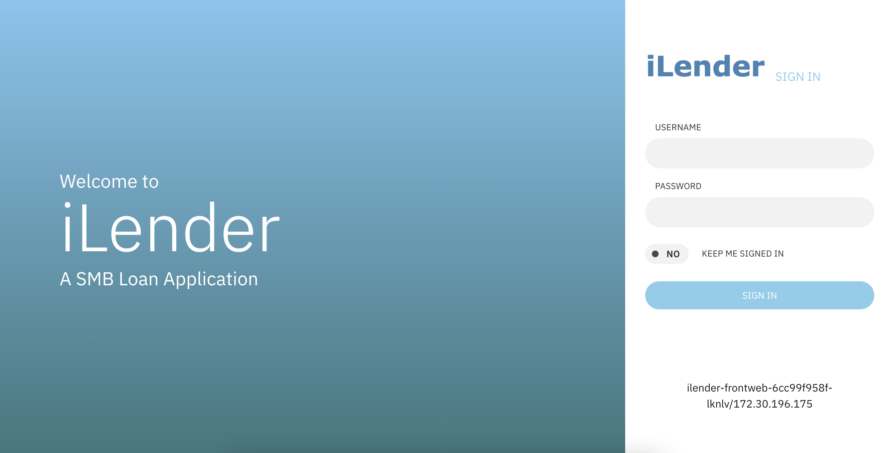
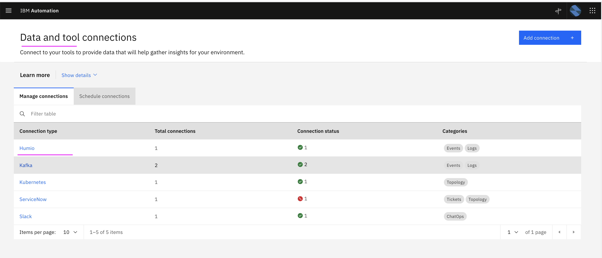
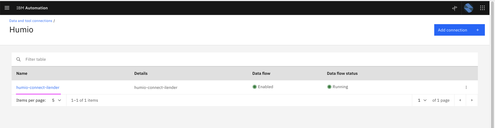
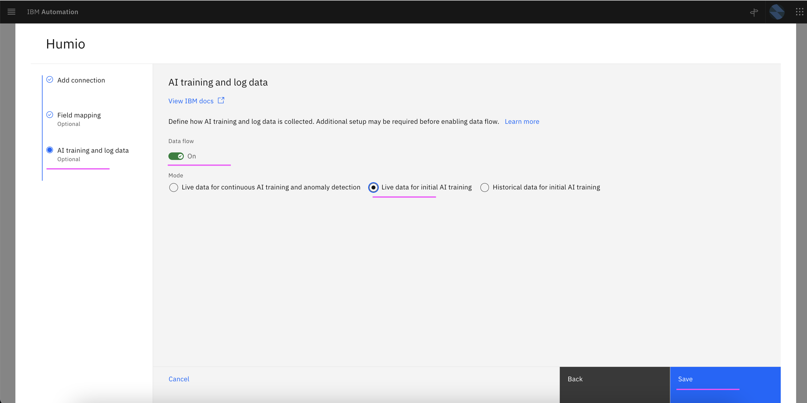
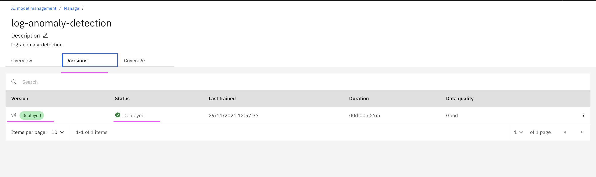

# Training - Log Amomaly

This article explains about how to do Training of Log Amomaly in Watson AIOps.

The article is based on the the following

- RedHat OpenShift 4.8 on IBM Cloud (ROKS)
- Watson AI-Ops 3.2.0

## 1. Application

We use iLender application. And assume that app is accessible via link http://1.1.1.1:31600

Refer : [20-application-installation](../20-application-installation) to get app url

## 2. Generate Load

Refer : [21-application-load-generation](../21-application-load-generation) to generate load in the application

## 3. Load Live logs for Training

While the load is ongoing in the application, do the following steps to enable the live log mode for copying the logs into AIMgr for training. 

1. Goto the page `Data and tool connections` and select `Humio` 

2. Click on the humio connection `humio-connect-ilender`

3. Select the `Data flow` : `On`

4. Select the `Mode` : `Live Data for Initial AI Training`

5. Click on the `Save`

Now the live data would get copied to AIMgr.

## 4. Stop Live logs

After 25 minutes, live logs can be disbled.

1. Select the `Data flow` : `Off`

2. Click on the `Save`

## 5. Stop Load

The load script would have been stopped after 20 minutes.

## 6. Start Training

1. Goto the page `AI Model Management`

2. Click on `Manage` tab

3. Click on `log-anomaly-detection` link

4. Click on `Start Training` link

The training would start and go for ``20 minutes` to `1 hour` based on the data size.

You will have `Training Complete` status once the training is done.

5. Click on `Versions` tab

You can see the version trained and deployed.

