# Sending Instana Events to WAIOps 3.2.0 AIMgr

This document explains about how to send Instana Events directly to WAIOps 3.2.0 AIMgr through Kafka topic.


## 1. Process

1. A Microservice called `WAIOps Hub` to be installed in WAIOps cluster.
2. Instana can send alers to `WAIOps Hub` via Webhook.
3. This `WAIOps Hub` will convert the instana events to NOI events and push the events to NOI Kafka topic in AIMgr.
4. AIMgr will process the event and create Alerts.

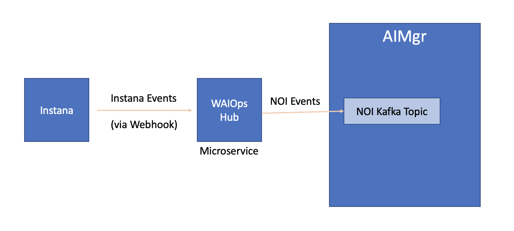

## 2. Installation

The `WAIOps Hub` can be installed via the script [files/deploy-waiops-hub.sh](./files/deploy-waiops-hub.sh). Here are the steps.

#### 1. Update NAMESPACE property

In the above script file, update the below property to point to WAIOps AIMgr installed namespace

```
NAMESPACE=cp4waiops
```

#### 2. Update NOI_KAFKA_TOPIC property

Update the below property to point to NOI Kafka topic that is created in AIMgr.

```
NOI_KAFKA_TOPIC=cp4waiops-cartridge-alerts-noi-7buu27a3
```

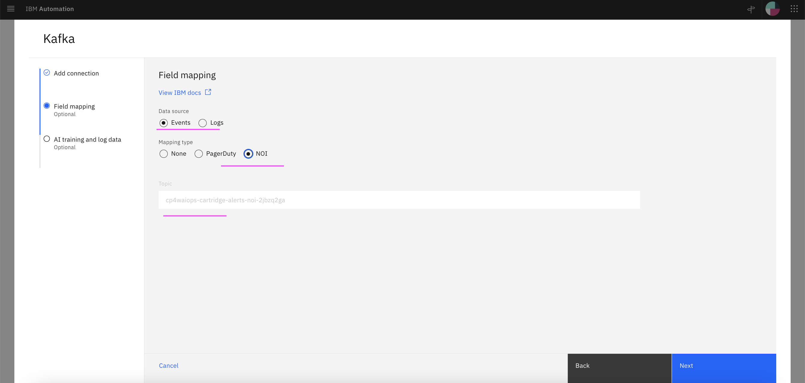

#### 3. Severity Filter property (Optional)

This property helps to process only the instana events that contains severity in the given range.

This is optional and leave the below default values as it is to skip the severity filter.

```
FILTER_SEVERITY_ENABLED=false
FILTER_SEVERITY_FROM=1
FILTER_SEVERITY_TO=1000
```

If you want to enable the severity filter, you can modify them.

- FILTER_SEVERITY_ENABLED - true 
- FILTER_SEVERITY_FROM - Severity start value 
- FILTER_SEVERITY_TO - Severity end value 


#### 4. Login into OCP Cluster

Login into the OCP Cluster where WAIOps AIMgr is installed 
```
oc login ....
```

#### 5. Install the WAIOps Hub

Run the script to install the WAIOps Hub microservice.

```
sh files/deploy-waiops-hub.sh
```

As a result, the WebHook url will be printed like the below.

  ===============================================================

WebHook URL : http://waiops-hub-core-waiops-hub-ns.aiops-320-4c84f197-0000.eu-de.containers.appdomain.cloud/api/core/instanaEvent

  ================================================================

#### 6. Create Instana Alert Channel

Create Instana alert channel with webhook and give the above printed url.

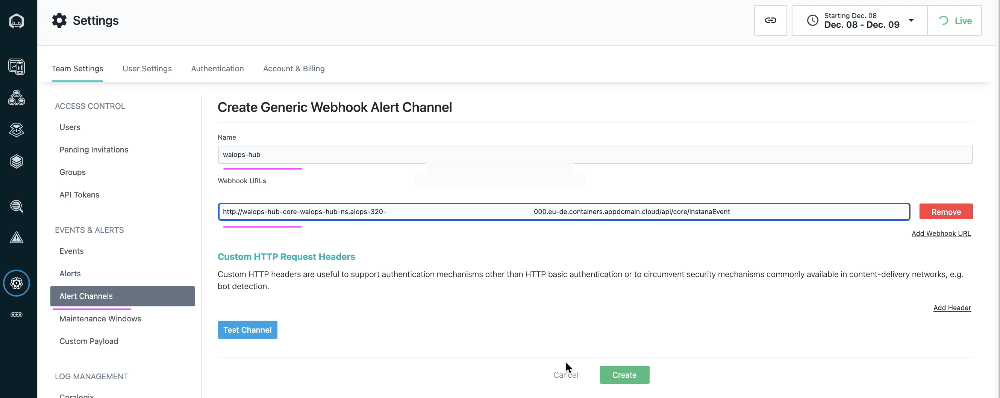


#### 7. Create Instana Alert

Create Instana `alert` for the corresponding Event and select the above created `Alert Channel`

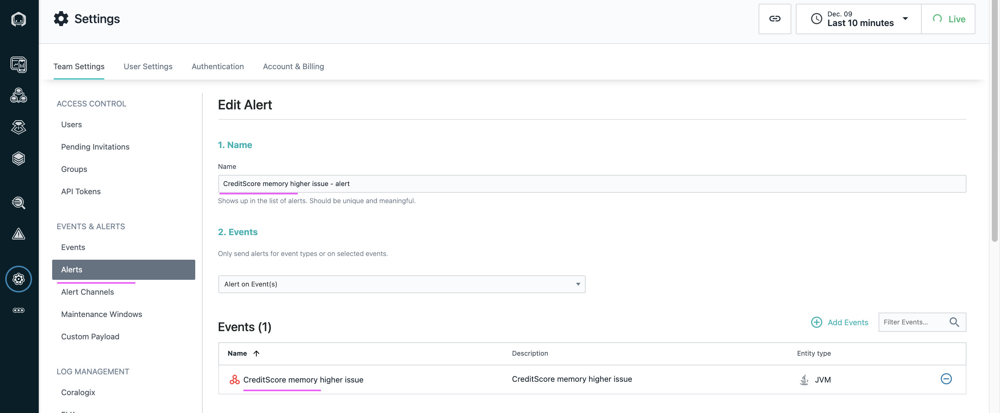
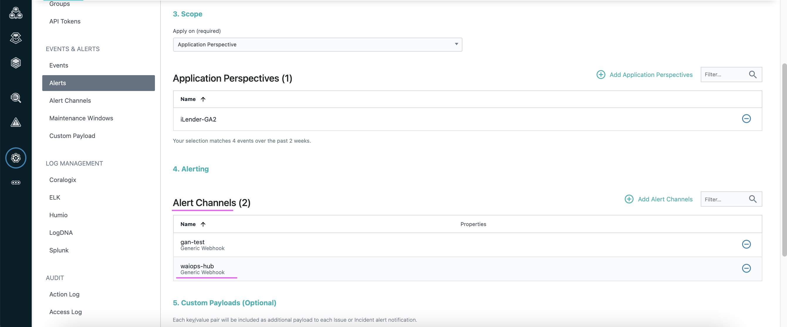

#### 8. Create Custom Payload for NodeAlias

Create custom payload in Isntana for the NodeAlias field.

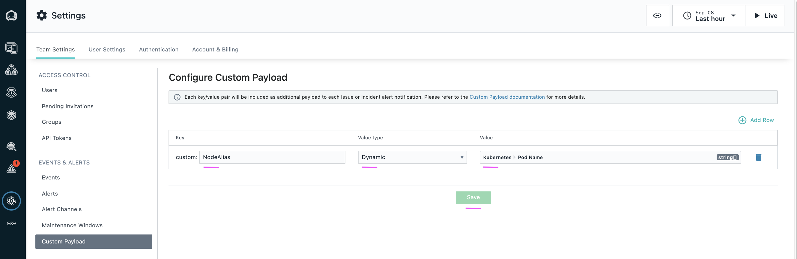

More details about this in : https://github.com/ibm-gsi-ecosystem/watson-ai-ops-instana/tree/main/3-custom-payload

#### 9. Generate the event and see the Alert in AIMgr AlertViewer.

Put the load in the application to generate the Instana event and see the event is created as alert in `Alert Viewer`.

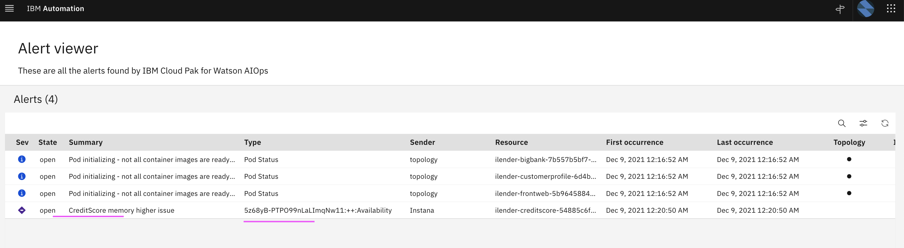


-----------
-----------

## 3. Events and Mapping

### 3.1 Events Status : Open

#### Instana Event

- Instana Event :  [files/1-instana-event-open.json](./files/1-instana-event-open.json)

#### NOI Event

- Converted NOI Event :  [files/1-noi-event-open.json](./files/1-noi-event-open.json)

#### Mapping

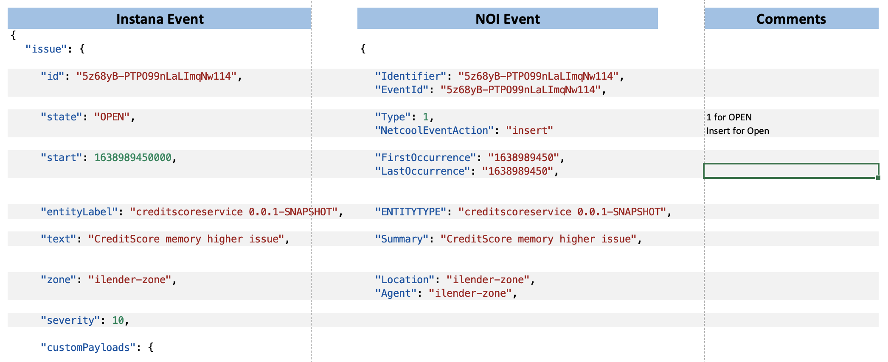
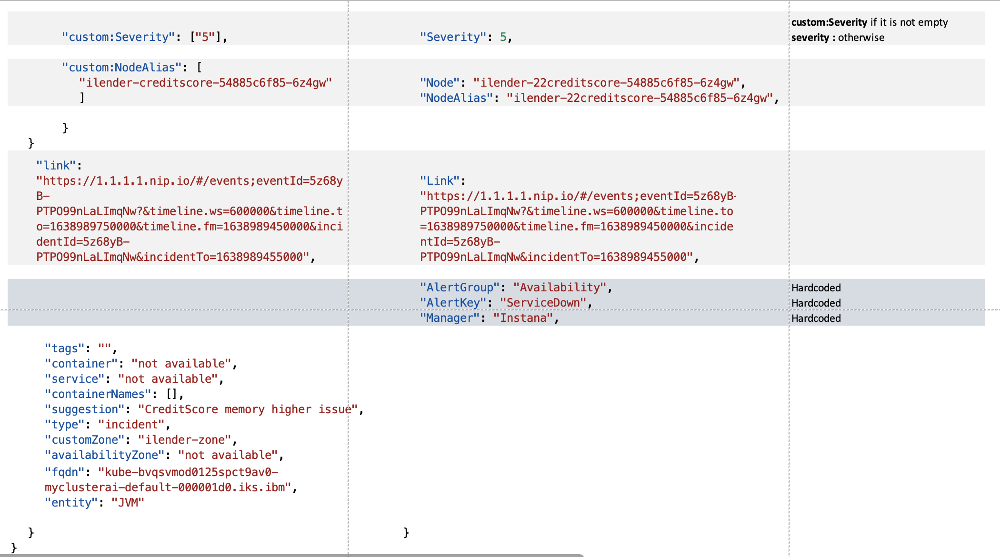


### 3.2 Events Status : Close

#### Instana Event

- Instana Event :  [files/2-instana-event-close.json](./files/2-instana-event-close.json)

#### NOI Event

- Converted NOI Event :  [files/2-noi-event-close.json](./files/2-noi-event-close.json)

#### Mapping

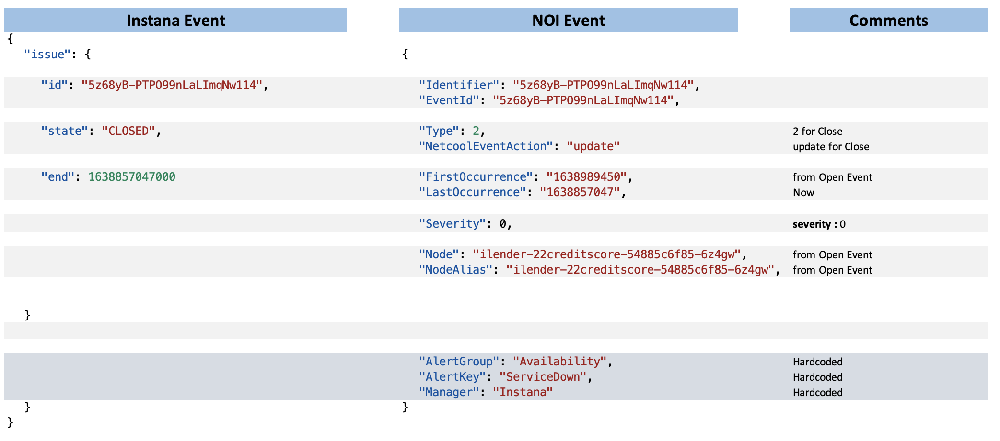

## 4. CustomPayLoads

As mentioned above the Instana event fileds are mapped to NOI events fields. It can be overridden by creating the CustomPayLoads in Instana. The following fields in the NOI events can be overridden by usingCustomPayLoads fields.

```
custom:Identifier
custom:EventId
custom:Node
custom:NodeAlias
custom:Manager
custom:Agent
custom:Summary
custom:Summary1
custom:Summary2
custom:Summary3
custom:Summary4
custom:ENTITYTYPE
custom:FirstOccurrence
custom:LastOccurrence
custom:AlertGroup
custom:AlertKey
custom:Type
custom:Location
custom:Link
custom:Severity
custom:NetcoolEventAction
```

#### 4.1 Instana Event with CustomPayLoads

- Instana Event :  [files/3-CustomPayLoads-instana.json](./files/3-CustomPayLoads-instana.json)

- Converted NOI Event :  [files/3-CustomPayLoads-noi.json](./files/3-CustomPayLoads-noi.json)

#### 4.2 Summary

Normally the `text` field in Instana is mapped to `Summary` field in NOI. 

There are three types possible here.

- Type 1: Without CustomPayLoads
- Type 2: With CustomPayLoads and Summary field
- Type 3: With CustomPayLoads and Summary1, Summary2, Summary3, Summary4 fields

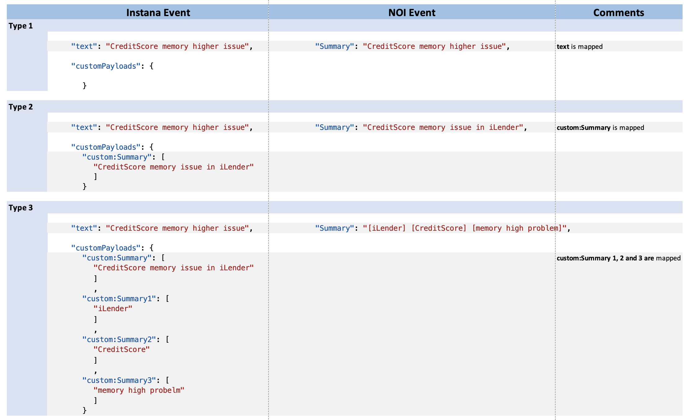


## 5. NOI Event to Alert Viewer Mapping

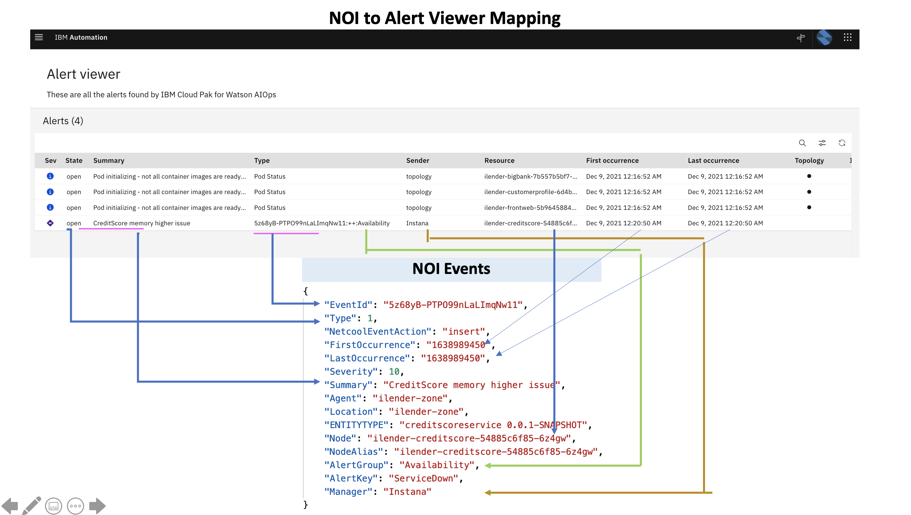

## 6. ReInstall and Remove

To reinstall or remove this  `WAIOps Hub`, you can delete the namespace `waiops-hub-ns`.

```
oc delete ns waiops-hub-ns
```

## 7. Note

This is `WAIOps Hub` is intended for POC.


